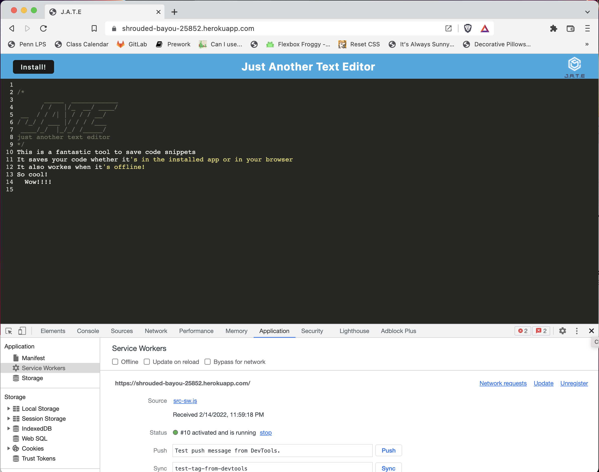

# JATE: Just Another Text Editor

## Description

JATE is a PWA that runs in a browser, allowing a user to create simple notes or code snippets. The single page app features a number of data persistence techniques that serve as redundancy in case one of the options is not supported by the browser. The application also functions offline.

## Table of Contents

- [Installation](#installation)
- [Usage](#usage)
- [User Story](#userstory)
- [Credits](#credits)
- [License](#license)
- [Questions](#questions)

## Installation

This api can be tested used locally on your machine by cloning the repo. Then in the command line use ```npm i``` to install dependencies and ```npm start``` to get the app to work on your local host. It can later be installed from your browser. 

For a live test of the app, go to the heroku deployed link at: https://shrouded-bayou-25852.herokuapp.com/

## User Story

```md
AS A developer
I WANT to create notes or code snippets with or without an internet connection
SO THAT I can reliably retrieve them for later use
```

## Usage



A video walk through of the functionality can be found here: [Video Walkthrough](https://drive.google.com/file/d/1ewXEPzFoTsfRSsmznkHdDQMe04f3P2L-/view?usp=sharing)

## Credits

Coding was completed by Lauren Ferrett, using develop files as well as references from class activities.

## License

MIT License

Copyright (c) 2022 Lauren Ferrett

Permission is hereby granted, free of charge, to any person obtaining a copy
of this software and associated documentation files (the "Software"), to deal
in the Software without restriction, including without limitation the rights
to use, copy, modify, merge, publish, distribute, sublicense, and/or sell
copies of the Software, and to permit persons to whom the Software is
furnished to do so, subject to the following conditions:

The above copyright notice and this permission notice shall be included in all
copies or substantial portions of the Software.

THE SOFTWARE IS PROVIDED "AS IS", WITHOUT WARRANTY OF ANY KIND, EXPRESS OR
IMPLIED, INCLUDING BUT NOT LIMITED TO THE WARRANTIES OF MERCHANTABILITY,
FITNESS FOR A PARTICULAR PURPOSE AND NONINFRINGEMENT. IN NO EVENT SHALL THE
AUTHORS OR COPYRIGHT HOLDERS BE LIABLE FOR ANY CLAIM, DAMAGES OR OTHER
LIABILITY, WHETHER IN AN ACTION OF CONTRACT, TORT OR OTHERWISE, ARISING FROM,
OUT OF OR IN CONNECTION WITH THE SOFTWARE OR THE USE OR OTHER DEALINGS IN THE
SOFTWARE.

## Questions
Any questions can be directed to lferrett@gmail.com.
